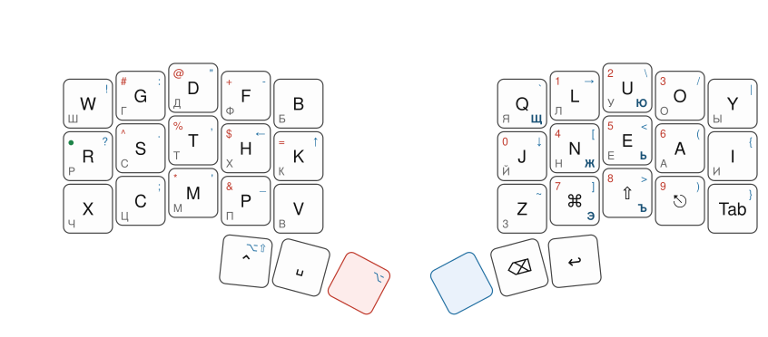

# APToshka

My 36-key keymap. The alpha arrangement comes from [APTv3](https://github.com/Apsu/APT); the rest — layers, sticky modifiers, thumb keys — is my own.

The big letter is what the key sends; red legends are the red layer, blue ones the blue layer, and the red/blue caps are the keys that reach those layers (the green dot on `R` reaches the green layer). Grey letters in the bottom-left corner show what the key produces in Russian through [Yasherty](https://github.com/didedoshka/yasherty); bold dark-blue ones are the Russian letters reached through the blue layer.

## Layers

The full keymap lives in [`proXiao.keymap`](config/boards/shields/proXiao/proXiao.keymap) with a picture of every layer in the comments:

- **white** — base: APTv3 alphas, sticky Cmd/Shift/Ctrl, space/backspace/enter on thumbs
- **blue** — punctuation, brackets and arrows
- **red** — digits (numpad-style) and the remaining symbols
- **green** — F-keys and bluetooth profile selection
- **yellow** — plain QWERTY with modifiers on the left, for games

For Russian I switch to [Yasherty](https://github.com/didedoshka/yasherty) at the OS level, so the keymap does not need to know about it.

## Firmware

This repository is also a working ZMK config for [proXiao](https://github.com/aroum/proXiao) bluetooth controllers. Every push triggers a GitHub Actions build (see [`build.yaml`](build.yaml)); download the firmware from the run's artifacts and copy the `.uf2` onto each half in bootloader mode. The `settings_reset` firmware from the same artifacts clears stored state (bluetooth pairing etc.).

> [!WARNING]
> The firmware here targets proXiao controllers (Seeed XIAO BLE) only — do not flash it onto other hardware. If your keyboard runs QMK or something else, recreate the keymap from the pictures in `proXiao.keymap` instead.

To make your own config: this repository started as a fork of [aroum/proXiao](https://github.com/aroum/proXiao), which supports several shields (Corne, Jorne, Fifi, …) on its branches. Fork it, pick the branch for your keyboard, and edit `config/boards/shields/proXiao/proXiao.keymap`.
